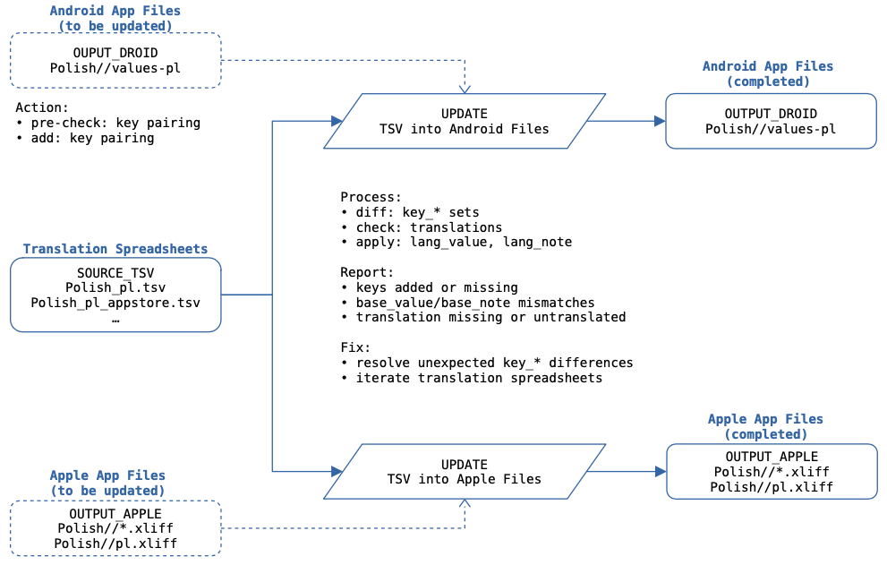

# Workflow: Import (TSV) Spreadsheets into Applications 

The _Import (TSV) Spreadsheets into Applications_ uses TSV spreadsheet data to update the Android and Apple source code files.

## Contents <a id="contents"></a>
[Steps](#steps-) •
[Report Information](#report-information-) •
[Example Batch Commands](#example-batch-commands-) •
[Resources](#resources-)




## Steps <a id="steps-"></a><sup>[▴](#contents)</sup>

1. Read mapping files.
2. Setup input & output files.
3. Process each TSV input line. Last write wins.

## Report Information <a id="report-information-"></a><sup>[▴](#contents)</sup>

* For translations, report non-translated lines where enUS==LANG.
* For `en`, report changed lines where enUS!=LANG.
* Malformed lines
* Duplicate keys. Duplicate keys with differing associated values

## Example Batch Commands <a id="example-batch-commands-"></a><sup>[▴](#contents)</sup>

``` sh
##########################
### IMPORT TRANSLATION ###
##########################
# Steps: 
#   1. Read mapping files.
#   2. Setup input & output files.
#   3. Process each TSV input line. Last write wins.
# Report:
#   * For translations, report non-translated lines where enUS==LANG.
#   * For `en`, report changed lines where enUS!=LANG.
#   * Malformed lines
#   * Duplicate keys. Duplicate keys with differing associated values

##########################
### IMPORT TRANSLATION ###
##########################
SOURCE_TSV="Spanish/tsv/Spanish_es.app.20210309.tsv"
OUTPUT_DROID="Spanish/android/values-es/strings.xml"    
OUTPUT_APPLE="Spanish/ios/es.xcloc/Localized Contents/es.xliff"   
DO_IMPORT_TSV

```

## Resources <a id="resources-"></a><sup>[▴](#contents)</sup>

* [Utility: AppLocalizer ⇗](../Utilities/AppLocalizerLib/README.md)
